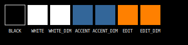
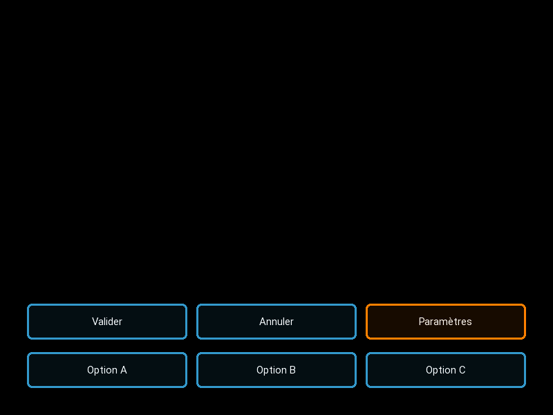
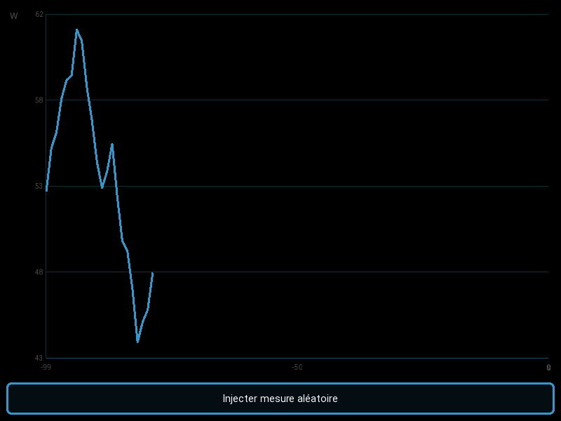
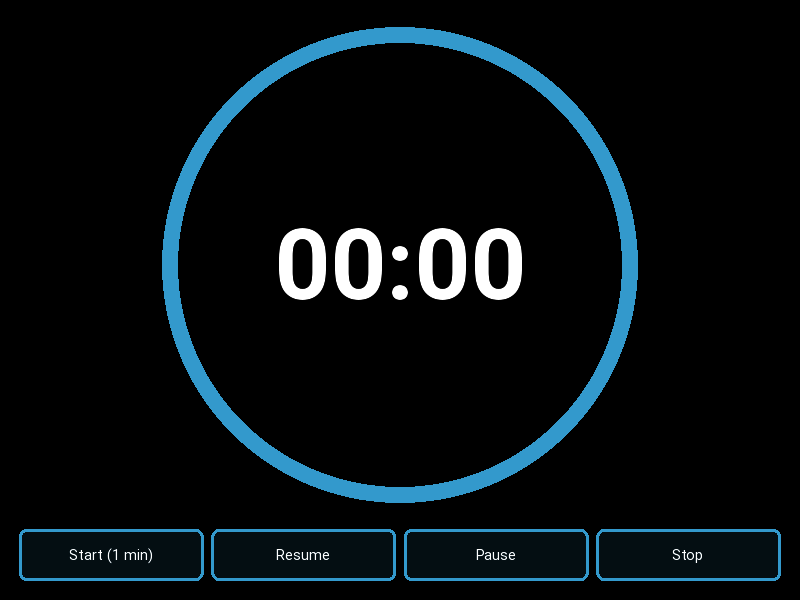
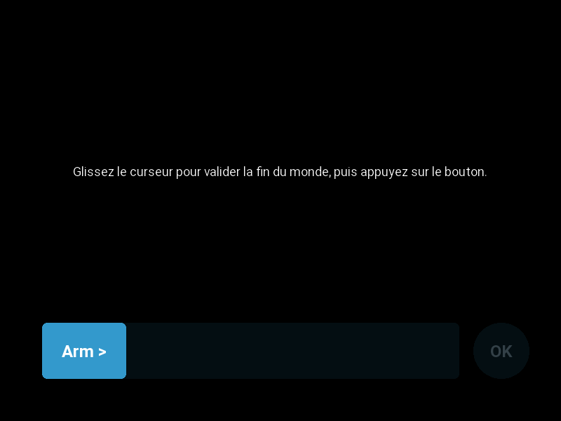
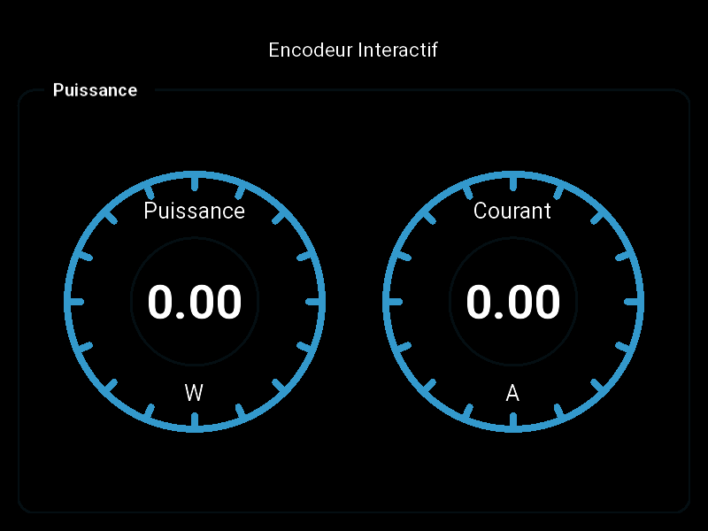
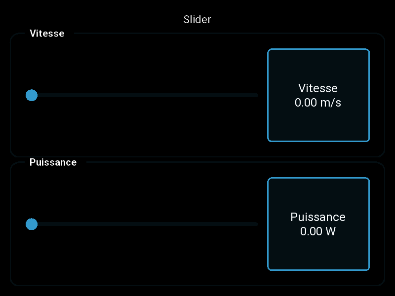

# Kivy Instrumentation Widgets

Un ensemble de composants d'instrumentation pour Python + Kivy, conçus pour créer des écrans de contrôle, des tableaux de bord et des interfaces de mesure.

# design

Axés sur un fond et les couleurs classiques de kivy. le design est flat pour être simple et fonctionnel.

* Fond : noir ( `#000000FF` )
* Texte : blanc ( `#FFFFFFFF` )
* Texte atténué (info secondaire) : blanc avec un alpha plus faible de 0.3 ( `#FFFFFF4D` )
* Éléments graphiques interactif : Bleu kivy ( `[0.2, 0.6, 0.8, 1]` ou `#336699FF`)
* Élémensts graphiques de décor : Bleu kivy avec un alpha plus faible de 0.3 ( `[0.2, 0.6, 0.8, 0.3]` ou `#3366994D`)
* Édition / focus : Orange ( `[1, 0.5, 0, 1]` ou `#FF8000FF` )
* Édition / focus atténué : Orange avec un alpha plus faible de 0.3 ( `[1, 0.5, 0, 0.3]` ou `#FF80004D` )

Palette de couleurs :



## Composants principaux

- **`FlatButton`, `FlatToggleButton`** (`src/flatbutton.py`)
  - Boutons plats avec effet de surbrillance et support de groupes de basculement.
- **`BorderWrapper`** (`src/borderwrapper.py`)
  - Conteneur avec bordure arrondie et titre intégré pour structurer les panneaux de contrôle.
- **`CircularGauge`** (`src/jauge.py`)
  - Jauge circulaire animée avec affichage de la valeur, de l'unité et d'une moyenne mobile.
- **`RollingChart`** (`src/rollingchart.py`)
  - Graphique en courbe à fenêtre glissante avec auto-échelle verticale et axes unitaires.
- **`CircularTimer`** (`src/timer.py`)
  - Timer visuel animé montrant le temps restant sous forme d'arc circulaire.
- **`ValidationWidget`** (`src/validationwidget.py`)
  - Contrôle de validation par glissement et action circulaire activable.
- **`UnitNumberPopup`** (`src/valuepopup.py`)
  - Popup numérique avec sélection de préfixes SI et d'unités compatibles via Pint.
- **`RotaryEncoderWidget`** (`src/encoder.py`)
  - Encodeur rotatif interactif pour l'ajustement fin de valeurs et l'affichage d'une unité.
- **`SliderWidget`** (`src/sliderwidget.py`)
  - Slider horizontal personnalisé avec label de valeur cliquable (à connecter à `UnitNumberPopup`) et réglage au clavier.

## Dependencies

- Python 3.14+
- Kivy 2.3+
- Pint

Le dépôt contient également un sous-dossier `pint-master/` pour la gestion locale de la dépendance Pint.

## Exemples de démo

Chaque module principal peut être démarré directement pour visualiser son application de test :

```bash
.venv/bin/python src/flatbutton.py
.venv/bin/python src/jauge.py
.venv/bin/python src/rollingchart.py
.venv/bin/python src/timer.py
.venv/bin/python src/validationwidget.py
.venv/bin/python src/valuepopup.py
.venv/bin/python src/encoder.py
.venv/bin/python src/sliderwidget.py
```

## Captures d'écran

Les captures d'écran de démonstration sont générées dans le dossier `screenshots/` :

- `screenshots/flatbutton.png`
- `screenshots/jauge.png`
- `screenshots/rollingchart.png`
- `screenshots/timer.png`
- `screenshots/validationwidget.png`
- `screenshots/valuepopup.png`
- `screenshots/encoder.png`
- `screenshots/sliderwidget.png`










## Génération des captures d'écran

Un script d'aide est disponible pour recréer les images automatiquement :

```bash
.venv/bin/python src/generate_screenshots.py src/<module>.py screenshots/<name>.png
```

Par exemple :

```bash
.venv/bin/python src/generate_screenshots.py src/flatbutton.py screenshots/flatbutton.png
```

## Tests

La suite de tests (unitaires et de performance) couvre tous les widgets et s'exécute avec pytest :

```bash
.venv/bin/pip install -r requirements-dev.txt
.venv/bin/python -m pytest
```

Une intégration continue GitHub Actions (`.github/workflows/ci.yml`) exécute cette suite à chaque push et pull request.

## Objectif du projet

Ce dépôt vise à fournir des éléments d'interface modernes et réutilisables pour des applications d'instrumentation embarquées ou de monitoring. Chaque widget est pensé pour s'intégrer dans des tableaux de bord Kivy et permet de gérer des unités physiques avec la bibliothèque Pint.
